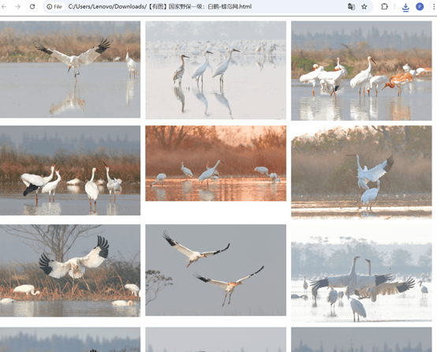
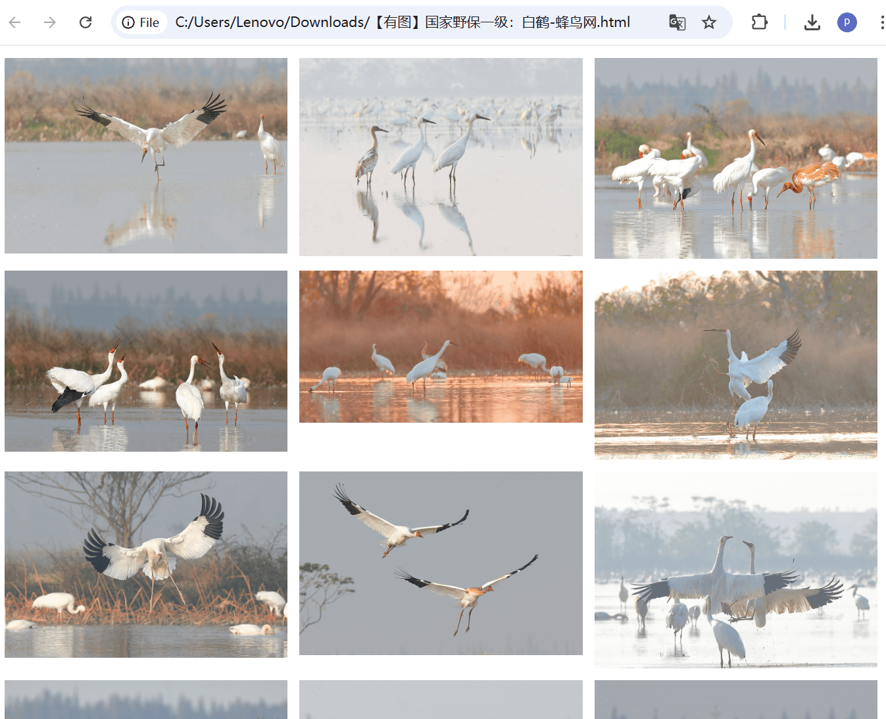
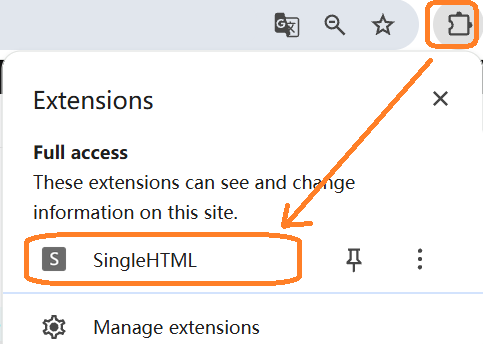
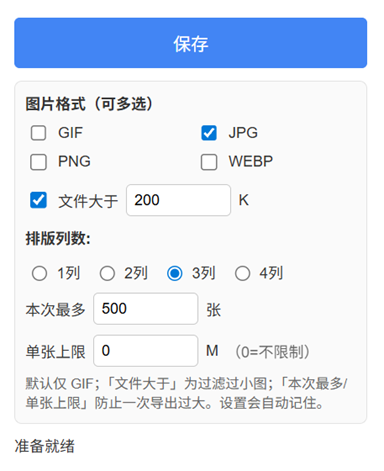

本程序是一个浏览器插件,下面描述用途和安装使用流程

# 将下面这样的网页
 

# 保存成单张网页
只有图片,能对图片进行行列排版,图片都塞入网页了(不依赖网络和外部文件)

# 使用方法:

- 下载本程序(gif_saver)到本机任意目录

- 用谷歌浏览器(chrome)或edge,在地址栏输入
chrome://extensions

- 在页面中找到: [开发人员模式], 打开它

- 然后在页面中找 [加载解压缩的扩展], 找到 gif_saver的目录

- 然后浏览器界面可以找到本插件:
 

- 点击[SingleHTML] 会弹出如下界面, 界面参数设置比较简单,自己看看,然后点击[保存]
 

这个插件适合做什么用呢? 适合找一些动图(比如日本的或欧洲的),然后保存.

